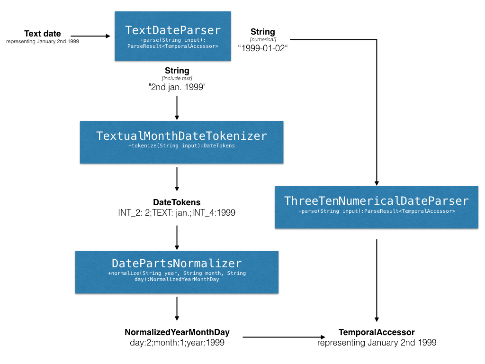

# Date Parsing - Documentation and Design Notes

## Documentation
### Main usage
The main purpose of these date parsing classes is to parse a String into a representation of a date when
the date format used is unknown. It is not intended to be a replacement for [SimpleDateFormat](https://docs.oracle.com/javase/8/docs/api/java/text/SimpleDateFormat.html)
or Java 8 [DateTimeFormatter](https://docs.oracle.com/javase/8/docs/api/java/time/format/DateTimeFormatter.html) and it is not based
on natural language like [Natty](http://natty.joestelmach.com/).

The date parsing is based on the [Java 8 DateTime API](https://www.oracle.com/technetwork/articles/java/jf14-date-time-2125367.html).

### TemporalAccessor and java.util.Date
The date parsing classes are all working with a [TemporalAccessor](https://docs.oracle.com/javase/8/docs/api/java/time/temporal/TemporalAccessor.html)
instance to represent a date. The implementations of this interface include: [LocalDate](https://docs.oracle.com/javase/8/docs/api/java/time/LocalDate.html),
[OffsetDateTime](https://docs.oracle.com/javase/8/docs/api/java/time/OffsetDateTime.html), partial date representation like
[YearMonth](https://docs.oracle.com/javase/8/docs/api/java/time/YearMonth.html) and [Year](http://docs.oracle.com/javase/8/docs/api/java/time/Year.html).

For backward compatibility it is possible to transform a `TemporalAccessor` into a `java.util.Date`.
See [TemporalAccessorUtils](https://gbif.github.io/parsers/apidocs/org/gbif/common/parsers/date/TemporalAccessorUtils.html) for utility methods and
[AtomizedLocalDate](https://gbif.github.io/parsers/apidocs/org/gbif/common/parsers/date/AtomizedLocalDate.html) for simple operations.

### Entry points
There are 5 methods on the [TemporalParser](https://gbif.github.io/parsers/apidocs/org/gbif/common/parsers/date/TemporalParser.html) interface
to parse dates.
They all return a `ParseResult<TemporalAccessor>` object.
```
- parse(String input)
- parse(String input), DateComponentOrdering ordering)
- parse(String input), DateComponentOrdering[] orderings)
- parse(String year, String month, String day)
- parse(Integer year, Integer month, Integer day)
```

## Design and implementation details

Design overview


### TemporalParser Workflow
In order to use the right parser, the `TemporalParser` default implementation (`TextDateParser`) will use a regular expression to determine if the input String contains only
numerical characters and separators or if it also includes some letters. The presence of letters may indicate the month
is written in text as opposed to its numerical value.

### ThreeTenNumericalDateParser
The `ThreeTenNumericalDateParser` contains a predefined set of date formats originally based on the [Threeten Backport](http://www.threeten.org/threetenbp/) project.
The set of predefined date formats can be seen as a set of 3 different types of format:

 * Unambiguous formats e.g. ISO based date formats
 * Possibly ambiguous formats with preference e.g. 2.6.2016 as used Germany
 * Possibly ambiguous formats e.g. 6/2/2016

The difference between "possibly ambiguous format with preference" and simply "possibly ambiguous format" appears when 2 patterns
can be applied to the provided String. In case of "with preference" we will prefer a format over the other and return the confidence
`ParseResult.CONFIDENCE.PROBABLE`. For possibly ambiguous formats without a preference the parsing will fail in case 2 patterns can be matched
unless the matches represent the exact same date e.g. 2/2/2016.

By default, this parser will not parse dates containing the year expressed as 2 digits. This feature can be enabled by using
the static method `newInstance(Year baseYear)`.

It is also possible to give a date component ordering to the parser when the order or the granularity of the date components is known.
The enumeration [DateComponentOrdering](https://gbif.github.io/parsers/apidocs/org/gbif/common/parsers/date/DateComponentOrdering.html)
contains the possible values.

```java
NumericalDateParser NUMERICAL_PARSER = DateParsers.defaultNumericalDateParser();

// this ParseResult will not be successful since this date is ambiguous
ParseResult<TemporalAccessor> ta = NUMERICAL_PARSER.parse("02/01/1999");

// but if we provide a DateComponentOrdering, we can get the expected result
ta = NUMERICAL_PARSER.parse("02/01/1999", DateComponentOrdering.MDY);
// or
ta = NUMERICAL_PARSER.parse("02/01/1999", DateComponentOrdering.DMY);
```

### TextualMonthDateTokenizer
This class is mostly used to break a string into different tokens.

### DatePartsNormalizer
This class is used to transform strings representing year, month and day and return the corresponding Integer as
[NormalizedYearMonthDay](https://gbif.github.io/parsers/apidocs/org/gbif/common/parsers/date/DatePartsNormalizer.NormalizedYearMonthDay.html).

```java
private static DatePartsNormalizer NORMALIZER = DatePartsNormalizer.newInstance();

DatePartsNormalizer.NormalizedYearMonthDay result = NORMALIZER.normalize("1975", "jan", "1");
// equals Integer 1975
result.getYear();
// equals Integer 1
result.getMonth();
// equals Integer 1
result.getDay();
```
